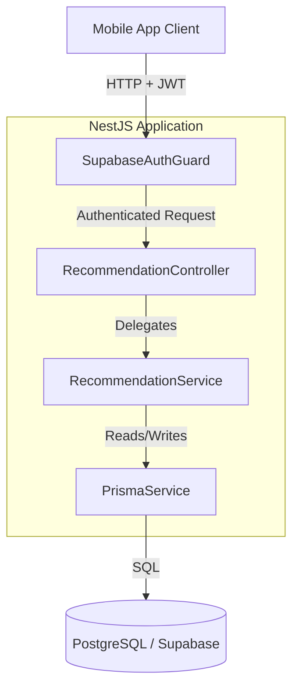
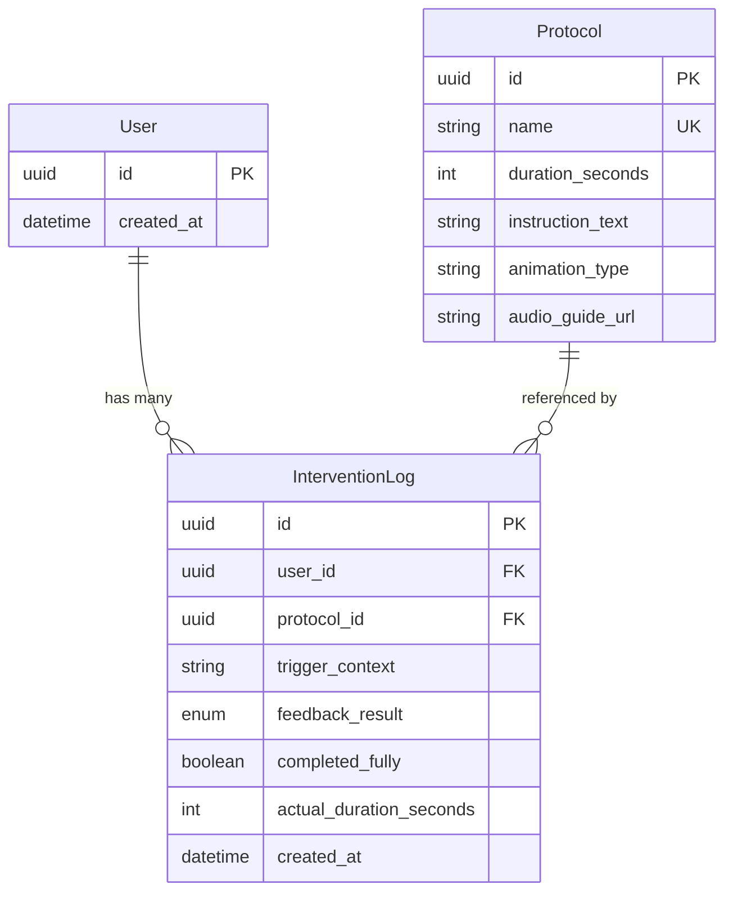
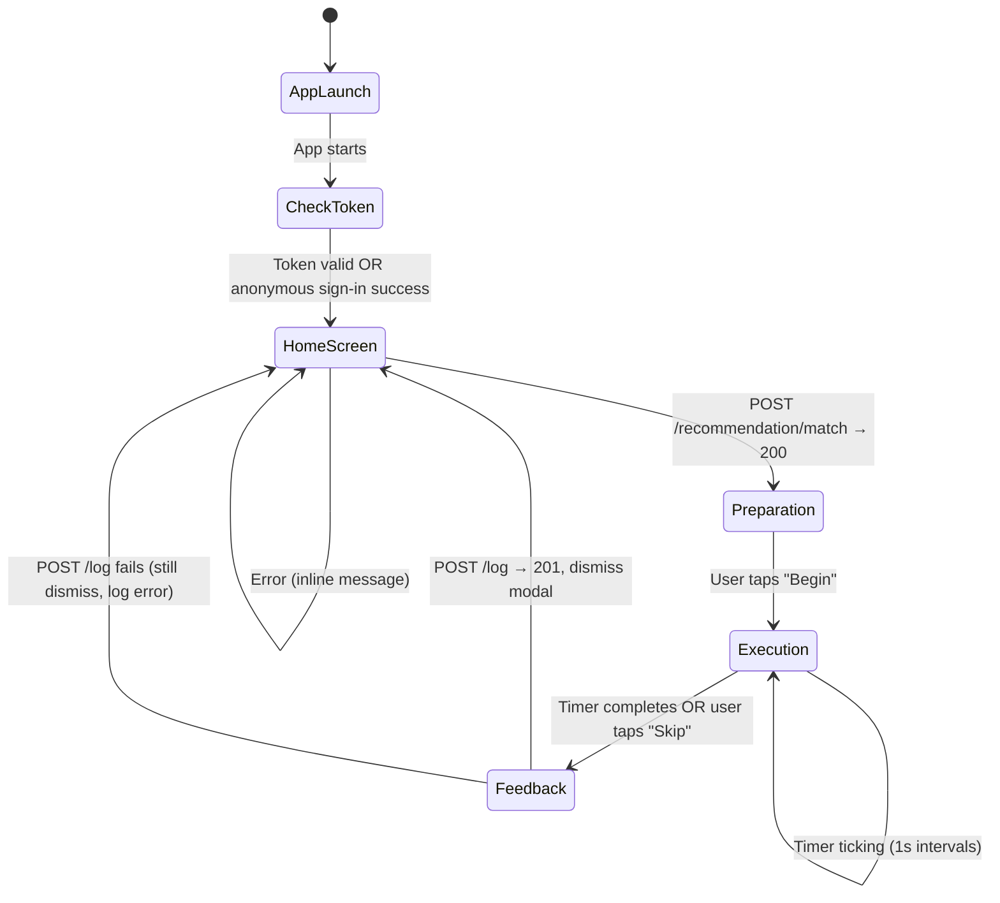
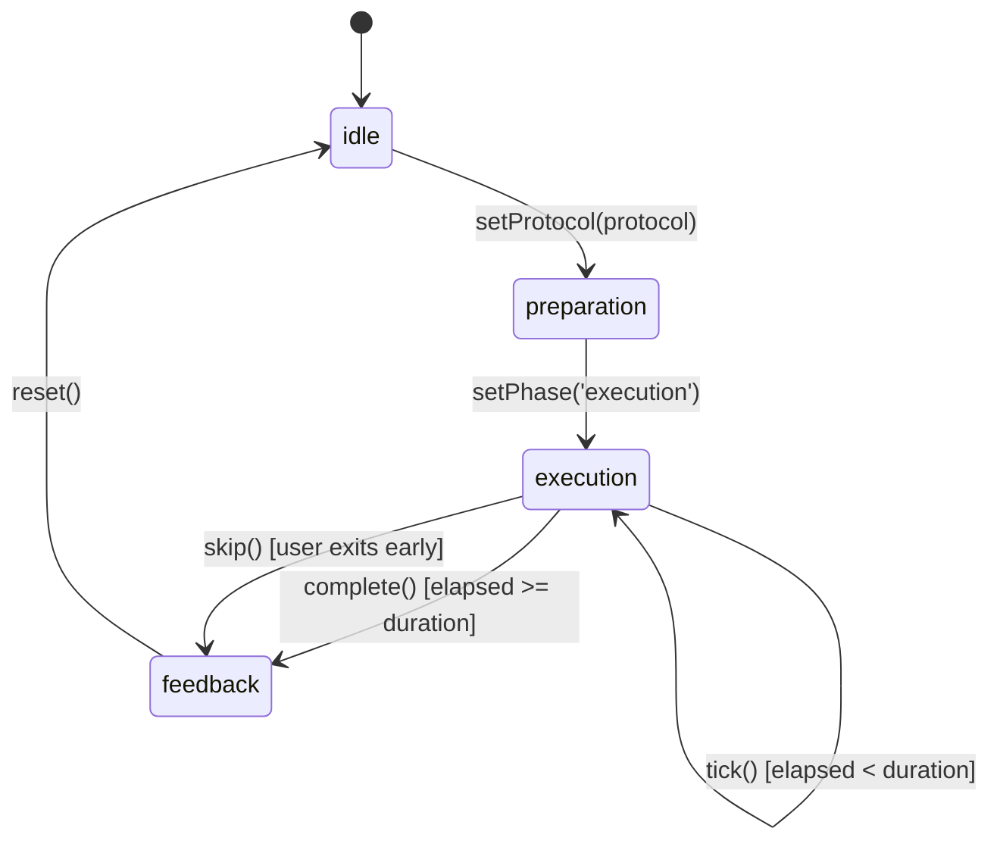

# Design Document: Recommendation Engine

## Overview

This is the full-stack design for Cadence, a somatic self-regulation app for burnout prevention. The system consists of two major components:

**Backend — Recommendation Engine API** provides two core endpoints:

1. **Protocol Recommendation** (`POST /recommendation/match`) — accepts a user's trigger context (free-text description of their stressor) and returns a matched somatic protocol using deterministic keyword-based rules.
2. **Intervention Logging** (`POST /log`) — records the user's post-intervention feedback, including which protocol was used, whether it was completed, and the self-reported outcome.

The backend is built with NestJS (TypeScript), uses Prisma ORM for database access against PostgreSQL (hosted on Supabase), and relies on Supabase Auth for JWT-based authentication.

**Frontend — Mobile Client** provides the user interface for the four-state intervention flow (Smart Trigger → Preparation → Execution → Feedback). Built with React Native (Expo) and TypeScript, it manages authentication state via Zustand, renders performant 60fps animations via React Native Reanimated, and navigates users through the intervention flow using React Navigation.

### Design Decisions

| Decision | Rationale |
|----------|-----------|
| Deterministic keyword matching (MVP) | Validates user flow before investing in ML; simple to test and reason about |
| Prisma ORM over raw SQL | Type-safe queries, auto-generated client, declarative schema migrations |
| Supabase JWT validation via custom guard | Avoids coupling to Supabase SDK at runtime; standard JWT verification is portable |
| Single NestJS module for recommendation + logging | Small bounded context; splitting would add unnecessary indirection at MVP scale |
| class-validator/class-transformer DTOs | NestJS-native validation pipeline; catches malformed input before business logic |
| Optimistic user insert in service layer | Uses optimistic execution: attempts InterventionLog INSERT first (assumes user exists), catches FK violation (P2003) and upserts user only on first encounter. Eliminates write-locks on users table for 99%+ of requests; reduces latency vs. upsert-every-time; simpler than Supabase DB triggers with no migration dependency on `auth` schema |
| ProtocolName enum + seed script | Eliminates fragile string coupling between matcher rules and DB; type-safe at compile time; seed script guarantees data consistency across environments |
| Connection pooling via PgBouncer (Supabase Transaction Pooler) | Supabase has a hard limit on direct connections (~60–100 on basic plans); PgBouncer multiplexes connections in transaction mode, preventing pool exhaustion under load; `directUrl` reserved for migrations only |
| Auth guard validates `role` claim | Prevents `anon` or `service_role` tokens from passing authentication; defense-in-depth beyond signature verification |
| DTO-level `.toLowerCase()` normalization | Centralizes normalization at the API boundary; downstream logic receives pre-normalized input without redundant transformations |
| User-not-found → 500 (not 404) | A valid JWT with no corresponding DB user is an infrastructure sync failure, not a client error; upsert strategy makes this a defensive fallback only |
| Accept duplicate intervention logs (MVP) | Simplifies MVP; idempotency via client-supplied key deferred to post-MVP |

## Architecture

The system follows a layered architecture within a single NestJS module:



### Request Flow

1. Client sends HTTP request with `Authorization: Bearer <supabase_jwt>` header
2. `SupabaseAuthGuard` validates the JWT signature and expiry using the Supabase JWT secret
3. Guard validates that `decoded.role === 'authenticated'` (rejects `anon` and `service_role` tokens)
4. Guard extracts `sub` claim (user ID) and attaches it to the request object
5. `ValidationPipe` validates the request body against the endpoint's DTO (including trim + lowercase normalization)
6. `RecommendationController` receives the validated request and delegates to `RecommendationService`
7. `RecommendationService` executes business logic (matching or logging) via `PrismaService`
8. For `/log`: service optimistically attempts to INSERT the InterventionLog (assumes user exists); if a FK constraint violation occurs (first-time user), it upserts the user record in `public.users` and retries the insert
9. Response is returned to the client

## Components and Interfaces

### Module Structure

```
src/
├── app.module.ts
├── main.ts
├── prisma/
│   └── prisma.service.ts          # PrismaClient wrapper as NestJS service
├── auth/
│   ├── auth.module.ts
│   ├── supabase-auth.guard.ts     # JWT validation guard
│   └── decorators/
│       └── current-user.decorator.ts  # Parameter decorator to extract user ID
├── recommendation/
│   ├── recommendation.module.ts
│   ├── recommendation.controller.ts
│   ├── recommendation.service.ts
│   ├── matching/
│   │   ├── keyword-matcher.ts     # Rule-based matching logic (pure function)
│   │   └── protocol-name.enum.ts  # ProtocolName enum (single source of truth)
│   └── dto/
│       ├── match-request.dto.ts
│       ├── match-response.dto.ts
│       ├── log-request.dto.ts
│       └── log-response.dto.ts
├── common/
│   └── filters/
│       └── prisma-exception.filter.ts  # Handles Prisma errors gracefully
prisma/
├── schema.prisma
└── seed.ts                            # Seeds Protocol table using ProtocolName enum values
```

### Key Interfaces

```typescript
// keyword-matcher.ts — Pure function, easily testable
interface MatchRule {
  keyword: string;
  protocolName: ProtocolName;
}

// protocol-name.enum.ts — Single source of truth for protocol names
enum ProtocolName {
  PhysiologicalSigh = 'Physiological Sigh',
  BoxBreathing = 'Box Breathing',
}

const MATCH_RULES: MatchRule[] = [
  { keyword: 'meeting', protocolName: ProtocolName.PhysiologicalSigh },
  { keyword: 'deadline', protocolName: ProtocolName.BoxBreathing },
];

const DEFAULT_PROTOCOL_NAME = ProtocolName.BoxBreathing;

function matchTriggerContext(triggerContext: string): ProtocolName {
  // Input arrives pre-normalized (trimmed + lowercased) from DTO @Transform
  for (const rule of MATCH_RULES) {
    if (triggerContext.includes(rule.keyword)) {
      return rule.protocolName;
    }
  }
  return DEFAULT_PROTOCOL_NAME;
}
```

```typescript
// recommendation.service.ts
class RecommendationService {
  constructor(private readonly prisma: PrismaService) {}

  async matchProtocol(triggerContext: string): Promise<Protocol> { ... }

  async logIntervention(userId: string, dto: LogRequestDto): Promise<InterventionLog> {
    // Optimistic Execution: assume user already exists (true for 99%+ of requests).
    // Only upsert on first-time users when FK constraint violation is caught.
    try {
      return await this.prisma.interventionLog.create({
        data: {
          user_id: userId,
          protocol_id: dto.protocol_id,
          trigger_context: dto.trigger_context,
          feedback_result: dto.feedback_result,
          completed_fully: dto.completed_fully ?? false,
          actual_duration_seconds: dto.actual_duration_seconds,
        },
      });
    } catch (error) {
      // P2003 = Foreign key constraint violation on `user_id`
      if (
        error instanceof Prisma.PrismaClientKnownRequestError &&
        error.code === 'P2003' &&
        (error.meta?.field_name as string)?.includes('user_id')
      ) {
        // First-time user: create the user record, then retry
        await this.prisma.user.upsert({
          where: { id: userId },
          create: { id: userId },
          update: {},
        });

        return await this.prisma.interventionLog.create({
          data: {
            user_id: userId,
            protocol_id: dto.protocol_id,
            trigger_context: dto.trigger_context,
            feedback_result: dto.feedback_result,
            completed_fully: dto.completed_fully ?? false,
            actual_duration_seconds: dto.actual_duration_seconds,
          },
        });
      }
      throw error; // Re-throw unexpected errors
    }
  }
}
```

```typescript
// recommendation.controller.ts
@Controller()
@UseGuards(SupabaseAuthGuard)
class RecommendationController {
  constructor(private readonly service: RecommendationService) {}

  @Post('recommendation/match')
  async match(@Body() dto: MatchRequestDto): Promise<MatchResponseDto> { ... }

  @Post('log')
  async log(
    @CurrentUser() userId: string,
    @Body() dto: LogRequestDto,
  ): Promise<LogResponseDto> { ... }
}
```

```typescript
// supabase-auth.guard.ts
@Injectable()
class SupabaseAuthGuard implements CanActivate {
  constructor(private readonly configService: ConfigService) {}

  async canActivate(context: ExecutionContext): Promise<boolean> {
    // 1. Extract Bearer token from Authorization header
    // 2. Verify JWT using SUPABASE_JWT_SECRET (jsonwebtoken.verify)
    // 3. Check expiry (handled by jsonwebtoken.verify with clockTolerance)
    // 4. Validate role claim: decoded.role MUST equal 'authenticated'
    //    - Reject 'anon' tokens (unauthenticated client requests)
    //    - Reject 'service_role' tokens (server-side admin tokens)
    //    - Throw UnauthorizedException if role !== 'authenticated'
    // 5. Attach decoded.sub (UUID) to request.user
    // 6. Return true or throw UnauthorizedException
  }
}
```

### DTO Definitions

```typescript
// match-request.dto.ts
class MatchRequestDto {
  @IsString()
  @IsNotEmpty({ message: 'trigger_context is required' })
  @MaxLength(500, { message: 'trigger_context must not exceed 500 characters' })
  @Transform(({ value }) => value?.trim().toLowerCase())
  trigger_context: string;
}

// log-request.dto.ts
class LogRequestDto {
  @IsUUID()
  protocol_id: string;

  @IsString()
  @IsNotEmpty()
  @MaxLength(500)
  trigger_context: string;

  @IsEnum(['better', 'no_change', 'worse'], {
    message: 'feedback_result must be one of: better, no_change, worse',
  })
  feedback_result: 'better' | 'no_change' | 'worse';

  @IsBoolean()
  @IsOptional()
  completed_fully?: boolean;

  @IsInt()
  @Min(0)
  @IsOptional()
  actual_duration_seconds?: number;
  // When undefined/omitted, Prisma stores NULL in the database.
  // @IsOptional() combined with Prisma's nullable field handles this correctly.
}
```

## Data Models

### Prisma Schema

```prisma
datasource db {
  provider  = "postgresql"
  url       = env("DATABASE_URL")       // PgBouncer (transaction pooler, port 6543)
  directUrl = env("DIRECT_URL")         // Direct connection (port 5432, for migrations only)
}

generator client {
  provider = "prisma-client-js"
}

model User {
  id         String   @id @db.Uuid
  created_at DateTime @default(now())

  intervention_logs InterventionLog[]

  @@map("users")
}

model Protocol {
  id                 String  @id @default(uuid()) @db.Uuid
  name               String  @unique @db.VarChar(100)
  duration_seconds   Int
  instruction_text   String  @db.VarChar(2000)
  animation_type     String  @db.VarChar(50)
  audio_guide_url    String? @db.VarChar(500)

  intervention_logs InterventionLog[]

  @@map("protocols")
}

enum FeedbackResult {
  better
  no_change
  worse
}

model InterventionLog {
  id                      String         @id @default(uuid()) @db.Uuid
  user_id                 String         @db.Uuid
  protocol_id             String         @db.Uuid
  trigger_context         String         @db.VarChar(500)
  feedback_result         FeedbackResult
  completed_fully         Boolean        @default(false)
  actual_duration_seconds Int?
  created_at              DateTime       @default(now())

  user     User     @relation(fields: [user_id], references: [id], onDelete: Cascade)
  protocol Protocol @relation(fields: [protocol_id], references: [id], onDelete: Restrict)

  @@map("intervention_logs")
}
```

### Entity Relationship Diagram



### Data Constraints

| Model | Field | Constraint |
|-------|-------|-----------|
| User | id | UUID, PK, sourced from Supabase Auth `sub` claim (not auto-generated) |
| Protocol | name | Unique, max 100 chars |
| Protocol | duration_seconds | Integer, 1–3600 |
| Protocol | instruction_text | Max 2000 chars |
| Protocol | animation_type | Max 50 chars |
| Protocol | audio_guide_url | Nullable, max 500 chars |
| InterventionLog | trigger_context | Max 500 chars |
| InterventionLog | feedback_result | Enum: better, no_change, worse |
| InterventionLog | completed_fully | Boolean, default false |
| InterventionLog | actual_duration_seconds | Nullable, min 0 |
| InterventionLog | user → User | Cascade delete |
| InterventionLog | protocol → Protocol | Restrict delete |

### Connection Pooling

The Prisma datasource uses two connection URLs to separate runtime queries from migration operations:

- **`DATABASE_URL`** — Points to Supabase's PgBouncer (transaction mode, port `6543`). All runtime queries from the NestJS application use this pooled connection. PgBouncer multiplexes a small number of real PostgreSQL connections across many application requests, preventing pool exhaustion under load.

- **`DIRECT_URL`** — Points to the direct PostgreSQL connection (port `5432`). Used exclusively by `prisma migrate deploy`, `prisma migrate dev`, and `prisma db push`. These commands require a direct connection because they use advisory locks and session-level features incompatible with PgBouncer's transaction mode.

**Rationale:** Supabase imposes a hard limit on direct connections (~60–100 on basic plans). Without PgBouncer, a NestJS application under moderate load can exhaust the connection pool, causing `FATAL: too many connections` errors. The transaction pooler eliminates this risk while maintaining full Prisma compatibility for runtime queries.


## Supabase Auth ↔ Prisma User Synchronization

### Problem

When a user authenticates via Supabase Auth, their record exists in the Supabase-managed `auth.users` table. However, the application's `public.users` table (managed by Prisma) is a separate table that must also contain the user record for foreign key relationships (e.g., `InterventionLog.user_id → User.id`) to work.

There is no automatic sync between `auth.users` and `public.users`.

### Solution: Optimistic Execution

The `RecommendationService.logIntervention` method uses an **optimistic write strategy**: it attempts to INSERT the `InterventionLog` directly (assuming the user already exists in `public.users`). Only when PostgreSQL returns a Foreign Key Constraint violation (Prisma error code `P2003` on the `user_id` field) does the service fall back to upserting the user and retrying the insert.

```typescript
try {
  // Optimistic path — assumes user exists (true for 99%+ of requests)
  return await this.prisma.interventionLog.create({ data: { user_id: userId, ... } });
} catch (error) {
  if (error.code === 'P2003' && error.meta?.field_name?.includes('user_id')) {
    // First-time user: create user record, then retry
    await this.prisma.user.upsert({
      where: { id: userId },
      create: { id: userId },
      update: {},
    });
    return await this.prisma.interventionLog.create({ data: { user_id: userId, ... } });
  }
  throw error;
}
```

This guarantees:
- First-time users are created transparently on their first intervention log
- Subsequent calls skip the upsert entirely — no write-lock on the `users` table, no extra round-trip
- Only the first request per user pays the cost of the fallback path (~0.01% of traffic after launch)
- No race conditions — upsert is atomic at the database level

### Alternatives Considered

| Alternative | Why Not Chosen |
|-------------|----------------|
| Upsert before every write | Acquires a write-lock on `users` table for every request; adds latency on 99%+ of calls that don't need it |
| Supabase SQL trigger on `auth.users` insert | Requires access to Supabase DB migrations; couples to Supabase internals; harder to test |
| Supabase webhook on user signup | Adds infrastructure complexity; webhook failures leave users in inconsistent state |
| Separate `/register` endpoint | Adds client-side complexity; user might skip registration and hit `/log` directly |

The optimistic execution approach is the best for MVP: no external dependencies, no migration into Supabase-managed schemas, minimal latency overhead, and the sync logic is visible and testable in application code.

## Database Seeding

### ProtocolName Enum

The `ProtocolName` enum (`src/recommendation/matching/protocol-name.enum.ts`) is the single source of truth for protocol names used across the codebase:

```typescript
// src/recommendation/matching/protocol-name.enum.ts
export enum ProtocolName {
  PhysiologicalSigh = 'Physiological Sigh',
  BoxBreathing = 'Box Breathing',
}
```

This enum is consumed by:
- `keyword-matcher.ts` — match rules reference `ProtocolName.PhysiologicalSigh` etc.
- `prisma/seed.ts` — seeds the Protocol table using enum values

### Seed Script (`prisma/seed.ts`)

The seed script ensures required Protocol records exist in every environment (development, staging, production). It uses a **create-if-not-exists** pattern: new protocols are inserted, but existing records are never overwritten — the database remains the source of truth for content after initial seeding.

```typescript
// prisma/seed.ts
import { PrismaClient } from '@prisma/client';
import { ProtocolName } from '../src/recommendation/matching/protocol-name.enum';

const prisma = new PrismaClient();

const PROTOCOLS = [
  {
    name: ProtocolName.PhysiologicalSigh,
    duration_seconds: 60,
    instruction_text: 'Double inhale through the nose, long exhale through the mouth...',
    animation_type: 'breathing_circle',
  },
  {
    name: ProtocolName.BoxBreathing,
    duration_seconds: 240,
    instruction_text: 'Inhale 4s, hold 4s, exhale 4s, hold 4s...',
    animation_type: 'box_square',
  },
];

async function main() {
  for (const protocol of PROTOCOLS) {
    await prisma.protocol.upsert({
      where: { name: protocol.name },
      create: protocol,
      update: {}, // Do NOT overwrite existing records — DB is source of truth for content after initial seed
    });
  }
}

main()
  .catch(console.error)
  .finally(() => prisma.$disconnect());
```

**Safe seeding behavior:**
- If a protocol with the given `name` does NOT exist → it is created with the values from the `PROTOCOLS` array.
- If a protocol with the given `name` already exists → the `update: {}` block is a no-op; existing `instruction_text`, `duration_seconds`, `animation_type`, and `audio_guide_url` values are preserved.
- To add a NEW protocol, simply append it to the `PROTOCOLS` array and run `npx prisma db seed` — it will be created without touching existing protocols.

Run via: `npx prisma db seed` (configured in `package.json` under `prisma.seed`).

## Operational Concerns

### Nullable Field Handling

When `actual_duration_seconds` is omitted from the `LogRequestDto` (i.e., `undefined`), Prisma stores `NULL` in the database column. The DTO's `@IsOptional()` decorator allows the field to be absent, and Prisma's nullable column definition (`Int?`) accepts `undefined` as equivalent to `NULL`. No explicit transformation is needed.

### Idempotency (Future Enhancement)

**Current MVP behavior:** Duplicate intervention logs from network retries are accepted. If a client retries a failed `/log` request, a second `InterventionLog` record may be created with identical content but a different `id` and `created_at`.

**Known limitation:** This is acceptable for MVP because:
- Intervention logs are append-only analytics data
- Duplicates don't affect user-facing behavior
- The volume of duplicates from retries is expected to be negligible

**Post-MVP enhancement:** Introduce a client-supplied `idempotency_key` (or `session_id`) field:
- Client generates a UUID per intervention session
- Server checks for existing log with the same key before inserting
- Returns the existing record if found (HTTP 200 instead of 201)
- Prevents duplicate records from network retries


## Mobile Client Architecture

### Tech Stack

| Technology | Purpose |
|-----------|---------|
| React Native (Expo) | Cross-platform mobile framework |
| TypeScript | Type safety across the codebase |
| Zustand | State management (3 slices: auth, protocol, session) |
| React Navigation | Navigation (flat structure — Home Screen + Modal for Intervention Flow) |
| React Native Reanimated | Animations (worklets on UI thread, 60fps) |
| Supabase JS Client | Anonymous sign-in (initialized with custom storage adapter wrapping expo-secure-store) |
| expo-secure-store | JWT persistence (platform-native encryption) |

### Frontend Module Structure

```
mobile/
├── app/
│   ├── App.tsx                        # Root component, navigation container
│   ├── navigation/
│   │   ├── RootNavigator.tsx          # Stack navigator (Home + Modal)
│   │   └── InterventionFlowNavigator.tsx  # Modal screens (Preparation, Execution, Feedback)
│   ├── screens/
│   │   ├── HomeScreen.tsx             # Trigger context input + submit
│   │   ├── PreparationScreen.tsx      # Protocol info display
│   │   ├── ExecutionScreen.tsx        # Animated timer (Reanimated)
│   │   └── FeedbackScreen.tsx         # Outcome selection
│   ├── store/
│   │   ├── useAuthStore.ts            # Auth slice (JWT, userId, isAuthenticated)
│   │   ├── useProtocolStore.ts        # Protocol slice (matched protocol or null)
│   │   └── useSessionStore.ts         # Session slice (phase, elapsed, completed)
│   ├── services/
│   │   ├── api.ts                     # Axios/fetch wrapper with JWT interceptor (uses useAuthStore.getState())
│   │   ├── auth.ts                    # Supabase Auth (anonymous sign-in, custom storage adapter)
│   │   └── secureStorage.ts           # expo-secure-store wrapper
│   ├── animations/
│   │   ├── BreathingCircle.tsx        # breathing_circle animation (Reanimated worklet)
│   │   └── BoxSquare.tsx              # box_square animation (Reanimated worklet)
│   ├── hooks/
│   │   ├── useTimer.ts                # Countdown timer hook with background tracking
│   │   └── useIntervention.ts         # Orchestrates the full intervention flow
│   └── types/
│       └── index.ts                   # Shared TypeScript interfaces (Protocol, SessionPhase, etc.)
```

### Frontend Design Decisions

| Decision | Rationale |
|----------|-----------|
| Zustand over Redux/Context | Minimal boilerplate, no providers needed, built-in persistence middleware, excellent TypeScript support |
| 3 separate stores vs 1 monolithic store | Isolation of concerns; auth changes don't trigger protocol/session re-renders |
| expo-secure-store for JWT | Platform-native encryption (iOS Keychain, Android Keystore); AsyncStorage is unencrypted |
| Anonymous sign-in by default | Zero-friction onboarding; user can start immediately without registration |
| Silent 401 retry (once) | Handles token expiry transparently; avoids showing auth errors for recoverable situations |
| Reanimated worklets on UI thread | JS thread remains free for state updates and network calls; animations never drop frames. On AppState resume, Reanimated shared values MUST be explicitly re-initialized (snapped) to the correct animation phase based on elapsed time delta to prevent visual jumping — the OS pauses worklets while backgrounded |
| AppState listener for background tracking | Calculates elapsed time delta on foreground resume; no background task needed for simple timer. On resume, both the JS timer state AND Reanimated shared values must be synchronized |
| React Navigation modal for Intervention Flow | Natural gesture-based dismiss prevention; clear visual separation from Home |
| Prevent back-navigation during Execution | Avoids accidental timer reset; user must explicitly Skip or complete |
| `EXPO_PUBLIC_` prefix for env vars | All frontend environment variables (API URL, Supabase keys) MUST use the `EXPO_PUBLIC_` prefix to ensure they are properly bundled by Expo into the client JS bundle. Variables without this prefix are NOT available at runtime |
| Reanimated Babel plugin | `react-native-reanimated/plugin` MUST be added as the LAST entry in the `plugins` array in `babel.config.js`. Without it, the app crashes on startup with a worklet initialization error |

### Frontend Key Interfaces

```typescript
// types/index.ts
interface Protocol {
  id: string;
  name: string;
  duration_seconds: number;
  instruction_text: string;
  animation_type: string;
  audio_guide_url: string | null;
}

type SessionPhase = 'idle' | 'preparation' | 'execution' | 'feedback';
type FeedbackResult = 'better' | 'no_change' | 'worse';

interface AuthState {
  token: string | null;
  userId: string | null;
  isAuthenticated: boolean;
  login: (token: string, userId: string) => void;
  logout: () => void;
  restoreToken: () => Promise<void>;
}

interface ProtocolState {
  protocol: Protocol | null;
  setProtocol: (protocol: Protocol) => void;
  clearProtocol: () => void;
}

interface SessionState {
  phase: SessionPhase;
  elapsedSeconds: number;
  completedFully: boolean;
  setPhase: (phase: SessionPhase) => void;
  tick: () => void;
  complete: () => void;
  skip: () => void;
  reset: () => void;
}
```

### Frontend Navigation Flow



### Frontend State Flow



### Frontend API Integration

- API client uses fetch/axios with an interceptor that reads JWT from the Zustand store
- **CRITICAL:** The API interceptor MUST access the token using the Zustand store's non-reactive static method (`useAuthStore.getState().token`), NOT via the React hook (`useAuthStore()`), to avoid React Hook Rule violations outside of React components
- On 401 response: interceptor clears token → triggers anonymous re-auth → retries request once
- Request timeout: 10 seconds for `/recommendation/match`, 15 seconds for `/log`
- No offline queue for MVP (requests fail immediately if no network)

### Supabase Client Storage Adapter

**CRITICAL:** The Supabase JS Client MUST be initialized with a custom `storage` adapter that wraps `expo-secure-store`. The default `AsyncStorage`-based persistence MUST be explicitly disabled in the Supabase client configuration to satisfy Property 12. Example:

```typescript
// services/auth.ts
import { createClient } from '@supabase/supabase-js';
import * as SecureStore from 'expo-secure-store';

const secureStoreAdapter = {
  getItem: (key: string) => SecureStore.getItemAsync(key),
  setItem: (key: string, value: string) => SecureStore.setItemAsync(key, value),
  removeItem: (key: string) => SecureStore.deleteItemAsync(key),
};

export const supabase = createClient(SUPABASE_URL, SUPABASE_ANON_KEY, {
  auth: {
    storage: secureStoreAdapter,
    autoRefreshToken: true,
    persistSession: true,
    detectSessionInUrl: false, // Not applicable in React Native
  },
});
```

## Correctness Properties

*A property is a characteristic or behavior that should hold true across all valid executions of a system — essentially, a formal statement about what the system should do. Properties serve as the bridge between human-readable specifications and machine-verifiable correctness guarantees.*

### Property 1: Keyword matching returns correct protocol

*For any* trigger context string containing a defined keyword (case-insensitive), the `matchTriggerContext` function SHALL return the protocol name associated with that keyword's rule — "meeting" maps to "Physiological Sigh", "deadline" maps to "Box Breathing".

**Validates: Requirements 2.2, 5.2, 5.3, 5.6**

### Property 2: Default fallback for unmatched contexts

*For any* trigger context string that does NOT contain any defined keyword ("meeting" or "deadline"), the `matchTriggerContext` function SHALL return "Box Breathing" as the default protocol name.

**Validates: Requirements 2.3, 5.5**

### Property 3: Priority resolution for multiple keyword matches

*For any* trigger context string containing both "meeting" and "deadline" (in any position or casing), the `matchTriggerContext` function SHALL return "Physiological Sigh" (the protocol associated with the first rule in definition order).

**Validates: Requirements 2.5, 5.4**

### Property 4: Whitespace-only trigger contexts are rejected

*For any* string composed entirely of whitespace characters (spaces, tabs, newlines), the DTO validation SHALL reject it as invalid, equivalent to an empty input.

**Validates: Requirements 2.4**

### Property 5: Intervention log persistence round-trip

*For any* valid combination of protocol_id (existing protocol), trigger_context (non-empty, ≤500 chars), feedback_result (valid enum value), completed_fully, and actual_duration_seconds, creating an InterventionLog and then reading it back SHALL produce a record with matching field values and a non-null id and created_at.

**Validates: Requirements 3.1**

### Property 6: Invalid feedback_result values are rejected

*For any* string that is NOT one of "better", "no_change", or "worse", submitting it as feedback_result SHALL result in a validation error (HTTP 400).

**Validates: Requirements 3.5**

### Property 7: DTO whitespace trimming is applied consistently

*For any* trigger_context string with leading or trailing whitespace, after DTO transformation the resulting value SHALL equal the original string with whitespace trimmed, and the trimmed value SHALL be used for keyword matching.

**Validates: Requirements 4.6, 4.7**

### Property 8: JWT sub claim extraction produces correct user identity

*For any* valid JWT token containing a UUID `sub` claim, the auth guard SHALL extract and attach that exact UUID as the authenticated user's identity on the request context.

**Validates: Requirements 6.3**

### Property 9: Session phase transitions are sequential

*For any* intervention session, the phase SHALL only transition in the order: idle → preparation → execution → feedback → idle. No phase SHALL be skipped or revisited within a single session.

**Validates: Requirements 7.4, 7.5, 8.5**

### Property 10: Timer elapsed never exceeds protocol duration

*For any* protocol with duration_seconds = D, the session.elapsed_seconds value SHALL never exceed D. When elapsed_seconds reaches D, the session SHALL transition to "feedback" with completed_fully = true.

**Validates: Requirements 10.1, 10.5**

### Property 11: Auth token is always present on API requests

*For any* HTTP request sent to the backend API, the Authorization header SHALL contain a Bearer token sourced from the Zustand auth store. If no token is available, the request SHALL NOT be sent until authentication completes.

**Validates: Requirements 9.4, 9.5**

### Property 12: Secure storage exclusivity for JWT

*For any* app session, the JWT token SHALL exist in exactly one persistent storage location: expo-secure-store. The token SHALL NOT be written to AsyncStorage, MMKV, or any unencrypted mechanism.

**Validates: Requirements 9.6, 9.7**

## Error Handling

### Error Response Format

All error responses follow a consistent JSON structure:

```json
{
  "statusCode": 400,
  "message": "trigger_context is required",
  "error": "Bad Request"
}
```

### Error Scenarios

| Scenario | HTTP Status | Error Message |
|----------|-------------|---------------|
| Missing/empty/whitespace trigger_context | 400 | "trigger_context is required" |
| trigger_context exceeds 500 chars | 400 | "trigger_context must not exceed 500 characters" |
| Missing required fields in log request | 400 | Array of validation error messages per field |
| Invalid feedback_result value | 400 | "feedback_result must be one of: better, no_change, worse" |
| Missing or invalid JWT token | 401 | "Authentication is required" |
| Expired JWT token | 401 | "Token is invalid" |
| JWT with non-authenticated role (anon/service_role) | 401 | "Token is invalid" |
| Valid JWT but user not in application DB (defensive) | 500 | "Internal server error" (critical log emitted; should never occur due to optimistic upsert strategy) |
| Protocol not found in database | 404 | "Protocol not found" |
| Database connection failure | 500 | "Internal server error" |

### Error Handling Strategy

1. **Validation errors** — Handled by the global `ValidationPipe`. class-validator decorators on DTOs produce structured error messages. The pipe returns 400 with all validation failures.

2. **Authentication errors** — Handled by `SupabaseAuthGuard`. Throws `UnauthorizedException` (401) for missing, expired, invalid tokens, or tokens with a non-`authenticated` role claim (e.g., `anon`, `service_role`).

3. **User sync failure (defensive)** — If the optimistic INSERT fails with a FK violation and the subsequent upsert+retry also fails unexpectedly (e.g., DB constraint race condition), the service logs a CRITICAL error and throws `InternalServerErrorException` (500). This scenario should never occur in normal operation because the retry path creates the user if absent. It is NOT a 404 because a valid JWT implies the user exists in Supabase Auth — a missing application DB record is an infrastructure sync failure.

4. **Not Found errors** — Handled in `RecommendationService`. When a database lookup returns null for a protocol, the service throws `NotFoundException` (404).

5. **Database errors** — Handled by a `PrismaExceptionFilter`. Catches Prisma-specific errors (connection failures, constraint violations) and maps them to appropriate HTTP responses. Constraint violations (e.g., duplicate protocol name) return 409. Connection failures return 500.

6. **Unexpected errors** — NestJS's built-in exception filter catches unhandled exceptions and returns 500 without leaking internal details.

### Logging

- All 5xx errors are logged with full stack traces for debugging
- 4xx errors are logged at warn level with request metadata (endpoint, user ID if available)
- Successful operations are logged at debug level

## Testing Strategy

### Property-Based Testing

The recommendation engine's core matching logic, DTO validation, and frontend state management are well-suited for property-based testing. The `keyword-matcher.ts` module is a pure function with clear input/output behavior and a large input space (arbitrary strings). The Zustand store actions (phase transitions, timer logic) are pure state transformations testable with generated inputs.

**Library:** [fast-check](https://github.com/dubzzz/fast-check) (TypeScript PBT library)

**Configuration:**
- Minimum 100 iterations per property test
- Each test tagged with: `Feature: recommendation-engine, Property {number}: {property_text}`

**Property tests cover:**
- Keyword matching correctness (Properties 1–3)
- Input validation (Properties 4, 6, 7)
- Persistence round-trip (Property 5)
- Auth extraction (Property 8)
- Session phase sequencing (Property 9)
- Timer bounds (Property 10)
- Auth token presence on requests (Property 11)
- Secure storage exclusivity (Property 12)

### Unit Tests (Example-Based)

Unit tests complement property tests for specific scenarios and integration points:

#### Backend Unit Tests

| Test Area | Examples |
|-----------|----------|
| Auth Guard | Missing token → 401, expired token → 401, invalid signature → 401, anon role → 401, service_role → 401 |
| Controller delegation | Verify controller calls service methods without business logic |
| Service user upsert | Optimistic path succeeds for existing user (no upsert), FK violation triggers upsert+retry for new user |
| Service with mocked Prisma | Non-existent protocol → 404, upsert failure → 500 (critical log) |
| Database error handling | Prisma throws → 500 response |
| user_id not accepted in body | Body with user_id field is ignored |
| DTO normalization | trigger_context arrives trimmed and lowercased at service layer |

#### Frontend Unit Tests

| Test Area | Examples |
|-----------|----------|
| Auth store actions | login() sets token + userId + isAuthenticated; logout() clears all |
| Protocol store actions | setProtocol() stores protocol; clearProtocol() resets to null |
| Session store actions | setPhase() updates phase; tick() increments elapsed; complete() sets completedFully; skip() records partial |
| Token restoration | restoreToken() reads from secure storage and hydrates store |
| API interceptor | Attaches Bearer token to all requests; retries once on 401 |
| Timer hook | Starts at duration, decrements each second, stops at zero |
| Background tracking | Calculates correct elapsed delta on foreground resume |

### Frontend Component Tests (React Native Testing Library)

| Test Area | Strategy |
|-----------|----------|
| HomeScreen | Renders input, character counter, submit button; shows error on API failure |
| PreparationScreen | Displays protocol name, duration, instruction text |
| ExecutionScreen | Shows timer, animation placeholder, skip button |
| FeedbackScreen | Renders outcome buttons (better, no_change, worse); submits on selection |
| Navigation | Modal opens on match success; dismisses on feedback completion |

### Integration Tests

Integration tests verify the full request lifecycle against a test database:

| Test Area | Strategy |
|-----------|----------|
| Cascade delete (User → InterventionLog) | Create user + logs, delete user, verify logs removed |
| Restrict delete (Protocol → InterventionLog) | Create protocol + logs, attempt delete, verify rejection |
| Unique constraint on Protocol.name | Insert duplicate, verify constraint error |
| Full endpoint flow | Authenticated request → match → log → verify persisted |

### Test Structure

```
test/
├── unit/
│   ├── keyword-matcher.spec.ts        # Property tests for matching logic
│   ├── recommendation.service.spec.ts  # Unit tests with mocked Prisma
│   ├── match-request.dto.spec.ts       # Property tests for DTO validation
│   ├── log-request.dto.spec.ts         # Property tests for DTO validation
│   └── supabase-auth.guard.spec.ts     # Unit + property tests for JWT extraction
├── integration/
│   ├── recommendation.e2e-spec.ts      # Full endpoint integration tests
│   └── prisma-constraints.spec.ts      # Database constraint tests
└── helpers/
    ├── generators.ts                   # fast-check arbitraries for domain types
    └── test-db.ts                      # Test database setup/teardown utilities

mobile/__tests__/
├── unit/
│   ├── useAuthStore.spec.ts            # Property tests for auth store (login/logout)
│   ├── useProtocolStore.spec.ts        # Unit tests for protocol store actions
│   ├── useSessionStore.spec.ts         # Property tests for phase transitions (Property 9) + timer (Property 10)
│   ├── api.spec.ts                     # Property tests for auth header presence (Property 11)
│   └── secureStorage.spec.ts           # Property tests for storage exclusivity (Property 12)
├── component/
│   ├── HomeScreen.spec.tsx             # Component render + interaction tests
│   ├── PreparationScreen.spec.tsx      # Protocol info display tests
│   ├── ExecutionScreen.spec.tsx        # Timer + animation rendering tests
│   └── FeedbackScreen.spec.tsx         # Outcome selection + submission tests
└── helpers/
    ├── generators.ts                   # fast-check arbitraries for frontend types (Protocol, SessionPhase)
    └── mockStore.ts                    # Zustand store test utilities
```

### Frontend Testing Notes

- **No E2E tests for MVP** — manual testing on device covers full flow
- **Property tests (fast-check)** target Zustand store logic: phase sequencing (Property 9), timer bounds (Property 10), auth header invariant (Property 11), storage exclusivity (Property 12)
- **Component tests** use React Native Testing Library with mocked stores and navigation
- **Animation tests** are limited to verifying worklet function signatures; actual 60fps validation is manual

### Test Generators (fast-check Arbitraries)

```typescript
// test/helpers/generators.ts — Custom arbitraries for backend domain types
import * as fc from 'fast-check';

// Trigger context that contains a specific keyword
const triggerWithKeyword = (keyword: string) =>
  fc.tuple(fc.string(), fc.string()).map(
    ([prefix, suffix]) => `${prefix}${keyword}${suffix}`
  );

// Trigger context with NO defined keywords
const triggerWithoutKeywords = fc.string().filter(
  (s) => !s.toLowerCase().includes('meeting') && !s.toLowerCase().includes('deadline')
);

// Whitespace-only strings
const whitespaceOnly = fc.stringOf(
  fc.constantFrom(' ', '\t', '\n', '\r', '\f')
).filter((s) => s.length > 0);

// Valid feedback result
const validFeedback = fc.constantFrom('better', 'no_change', 'worse');

// Invalid feedback result (not in enum)
const invalidFeedback = fc.string().filter(
  (s) => !['better', 'no_change', 'worse'].includes(s)
);

// Valid trigger context (non-empty, ≤500 chars, trimmed non-empty)
const validTriggerContext = fc.string({ minLength: 1, maxLength: 500 }).filter(
  (s) => s.trim().length > 0
);
```

```typescript
// mobile/__tests__/helpers/generators.ts — Custom arbitraries for frontend types
import * as fc from 'fast-check';

// Valid Protocol object
const arbProtocol = fc.record({
  id: fc.uuid(),
  name: fc.string({ minLength: 1, maxLength: 100 }),
  duration_seconds: fc.integer({ min: 1, max: 3600 }),
  instruction_text: fc.string({ minLength: 1, maxLength: 2000 }),
  animation_type: fc.constantFrom('breathing_circle', 'box_square'),
  audio_guide_url: fc.option(fc.webUrl(), { nil: null }),
});

// Valid session phase
const arbSessionPhase = fc.constantFrom('idle', 'preparation', 'execution', 'feedback');

// Valid phase transition sequence (always sequential)
const arbValidPhaseSequence = fc.constant(['idle', 'preparation', 'execution', 'feedback', 'idle']);

// Random elapsed seconds within a protocol duration
const arbElapsedWithinDuration = (maxDuration: number) =>
  fc.integer({ min: 0, max: maxDuration });

// JWT-like token string
const arbToken = fc.string({ minLength: 20, maxLength: 500 }).map(
  (s) => `eyJ${Buffer.from(s).toString('base64').slice(0, 100)}`
);

// Valid user ID (UUID format)
const arbUserId = fc.uuid();

// Feedback result
const arbFeedbackResult = fc.constantFrom('better', 'no_change', 'worse');
```
